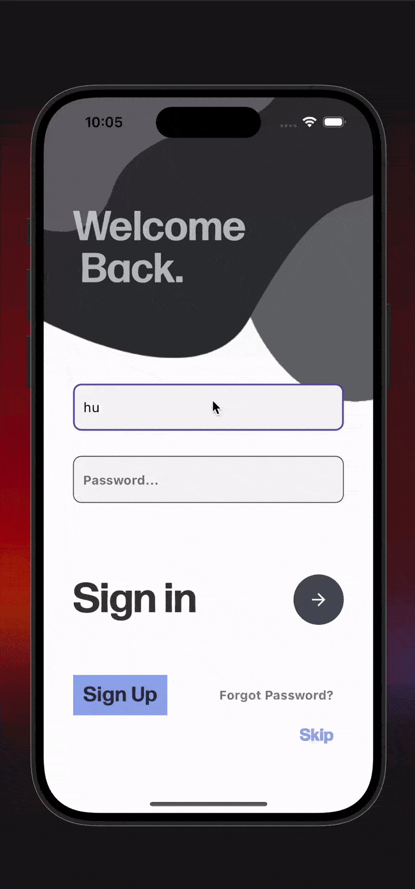

# TrendView

**A Personalized News Aggregator**

## Overview

TrendView is a news aggregation app designed to provide users with personalized, real-time news updates from a variety of sources using the Perigon.io API. The app offers features such as browsing categorized sections, saving favorite articles, and following specific sources to stay updated on topics of interest.

## Features

- **Breaking News**: Get the latest headlines instantly.
- **Categorized Sections**: Explore news based on topics of interest.
- **Bookmarks**: Save articles to read later.
- **Source Following**: Follow specific news outlets for tailored content.
- **Search Functionality**: Find articles or topics effortlessly.
- **WebView Integration**: View full articles within the app.

The app is built using **Flutter** with state management handled through **Provider**, ensuring a smooth and responsive user experience.

## Demo

|                    **Failed Verification**                    |                   **Success Verification**                    |                         **Search**                          |
| :-----------------------------------------------------------: | :-----------------------------------------------------------: | :---------------------------------------------------------: |
|  |  |  |

|                        **Bookmarks**                        |                        **WebView**                        |
| :---------------------------------------------------------: | :-------------------------------------------------------: |
|  |  |

## Installation and Usage (End Users)

### Prerequisites

- **Flutter SDK** (version 3.0 or above)
- Android/iOS Emulator or Physical Device

### Installation

1. **API Key Setup**

   - Create an account on [Perigon.io](https://perigon.io) to generate an API key.
   - Open the `lib/utils/secrets.dart` file and replace the placeholder with your API key:
     ```dart
     const String apiKey2 = "YOUR_API_KEY_HERE";
     ```

2. **Clone the Repository**

   - Clone the repository using the following commands:

     ```bash
     git clone https://github.com/hussainkazarani/trendview.git
     cd trendview
     ```

   - Alternatively, download the zip file:
     - Download from [here](https://github.com/hussainkazarani/trendview/archive/refs/heads/main.zip).
     - Unextract the zip file.
     - Navigate to `lib/utils/secrets.dart` and enter your API key as described above.

3. **Install Dependencies**

   ```bash
   flutter pub get
   ```

4. **Run the App**
   ```bash
   flutter run
   ```
